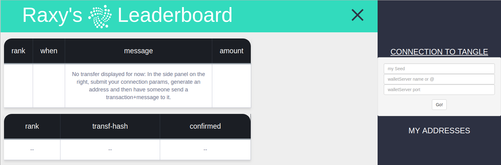

---

## IOTA Leaderboard2: Micropayments and Messaging Example
### Modded by raxy.

### IOTA Proof of Concept Application example with tutorial. Please head to the [IOTA Learn Tutorial](https://learn.iota.org/tutorial/payments-and-messaging-leaderboard) for more information.

## Instructions
### Open right side panel; enter seed, hostname or IP @ of wallet server, usage of https, and wallet server's port; then tap 'Go!' and see in main page the list getting updated when a transfer arrives.

